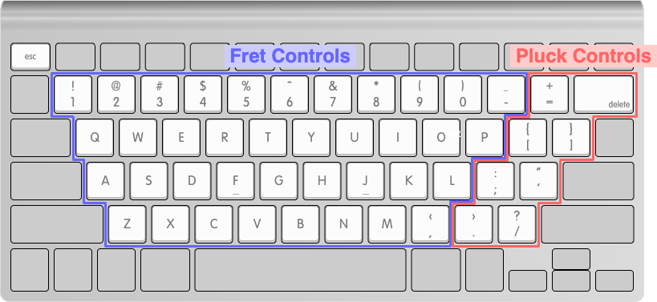

# 𝄢 bassit - bass in terminal

[](https://github.com/Golevka2001/bassit/actions/workflows/go.yml)
[](https://goreportcard.com/report/github.com/Golevka2001/bassit)
[](https://pkg.go.dev/github.com/Golevka2001/bassit)

Tired of typing commands? Time to play some bass 🎸

`bassit` is a terminal-based bass guitar simulator written in Go. It allows you to play bass lines on your keyboard.

Supported on **Linux**, **macOS**, and **Windows**.

## :rocket: Quick Start

### :vertical_traffic_light: Before You Begin

1. See the [Dependencies](#building_construction-dependencies) section below for installation instructions.

2. To avoid character encoding or alignment issues, please make sure:
   - You are using the **UTF-8 character set**
     - On Linux or macOS, you can check your current character set settings by running the `locale` command.
     - On Windows, you can check your current character set settings in PowerShell by running `$OutputEncoding`.
   - You are using a **monospace font** (fixed-width font) in your terminal.

### :computer: Install and Run

```sh
# Ensure Go>=1.23 is installed
go version

# Install bassit
go install github.com/Golevka2001/bassit@latest

# Run
$GOPATH/bin/bassit
# OR if you have the Go bin directory in your PATH
bassit
```

### :keyboard: Keybindings



#### Basic Controls

- `Ctrl+C`: Exit the application
- `→` / `Tab`: Switch to the next tab
- `←` / `Shift+Tab`: Switch to the previous tab

#### Fret Controls

Press one of the following keys to **press a fret** on a specific string:

|    Key    | String |    Range     |
| :-------: | :----: | :----------: |
| `1` ~ `-` |   G    | fret 1 to 11 |
| `q` ~ `p` |   D    | fret 1 to 10 |
| `a` ~ `l` |   A    | fret 1 to 9  |
| `z` ~ `,` |   E    | fret 1 to 8  |

#### Pluck Controls

Press one of the following keys to **pluck** the corresponding string (make the note sound):

|       Key        | String |
| :--------------: | :----: |
| `=`, `Backspace` |   G    |
|     `[`, `]`     |   D    |
|     `;`, `'`     |   A    |
|     `.`, `/`     |   E    |

> 💡 **Tip:** To play a note, first press a fret key, then pluck the corresponding string.

## :building_construction: Dependencies

### :penguin: Linux

<details>
<summary><strong>TL;DR</strong></summary>

- On **Debian-based** distributions, the following packages are required:
  - `libasound2-dev` (required by [Oto](https://github.com/ebitengine/oto?tab=readme-ov-file#linux))
  - `rubberband-cli`

- On **RedHat-based** distributions, the following packages are required:
  - `alsa-lib-devel` (required by [Oto](https://github.com/ebitengine/oto?tab=readme-ov-file#linux))
  - `rubberband` *(except for OpenSUSE, which uses `rubberband-cli`)*

</details>
</br>

**Install `alsa` (required by Oto):**

See [Oto's README](https://github.com/ebitengine/oto?tab=readme-ov-file#linux).

**Install `rubberband-cli` or `rubberband`:**

Debian, Ubuntu, and openSUSE users can install `rubberband-cli`:

```sh
apt install rubberband-cli
```

Other distributions can install `rubberband`:

```sh
apk add rubberband
# OR dnf install rubberband
# OR pacman -S rubberband
# etc.
```

If your Linux distribution is not listed on [pkgs.org](https://pkgs.org/download/rubberband), you may need to build from source, see [their repository](https://github.com/breakfastquay/rubberband).


## :toolbox: Third-Party Libraries & Assets

- [Rubber Band Library](https://breakfastquay.com/rubberband/)
  - License: [GPLv2](https://github.com/breakfastquay/rubberband/blob/default/COPYING)
  - It is used for generating pitch-shifted audio samples.
- [A bass sound sample from Pixabay](https://pixabay.com/sound-effects/bass-guitar-c2-raw-101274/)
  - License: [Pixabay Content License](https://pixabay.com/service/license-summary/)
  - It is trimmed and pitch-shifted to create the bass sound.
